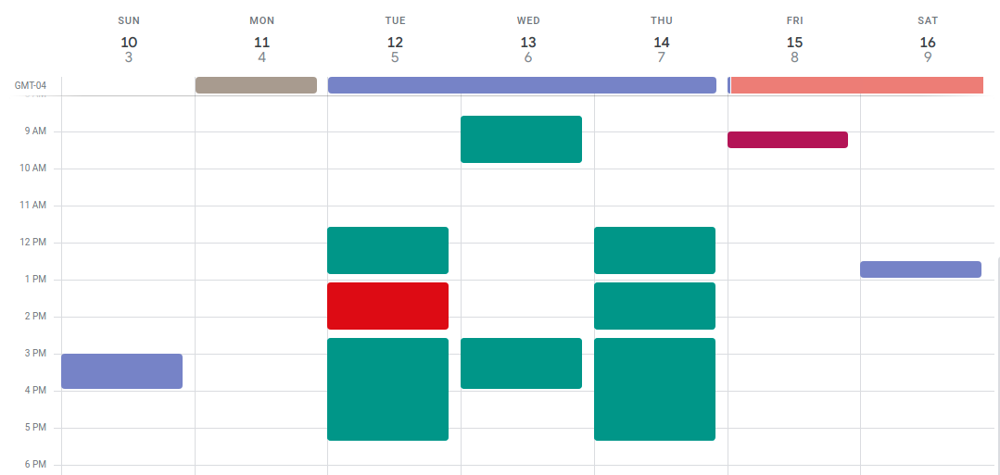

# Event Detail Concealer
This is a chrome extension that when toggled, will hide the details of the events on your calendar so that you can screenshot & share it with only the blocks showing. 

The purpose is to share availability without sharing other life details. 

Example:

Next Step:
- Add ability to only hide title, not time
- Take functionality to take a screenshot (& copy it to clipboard automatically)

 
<h5> Acknowledgements </h5>

###### Thanks to the people behind [gcal-mutlical-event-merge](https://github.com/imightbeamy/gcal-multical-event-merge) for making their code open source. I used their extension as a guide to create this one.